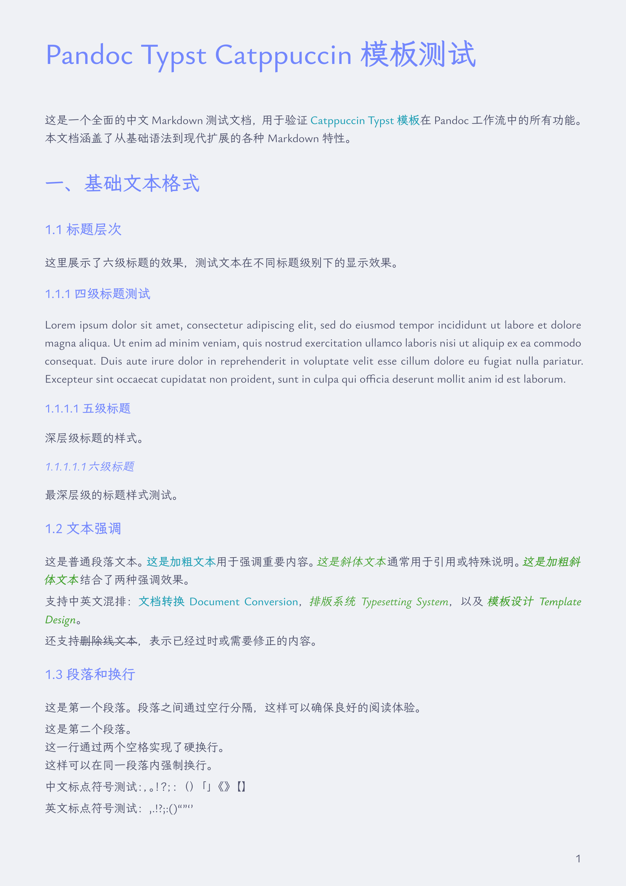
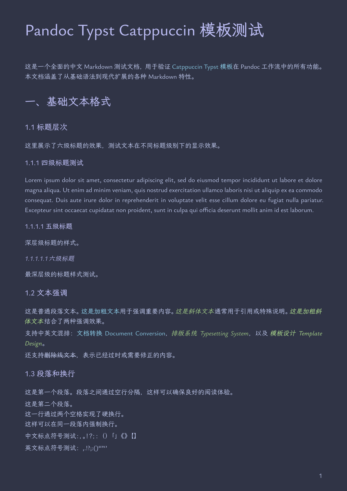
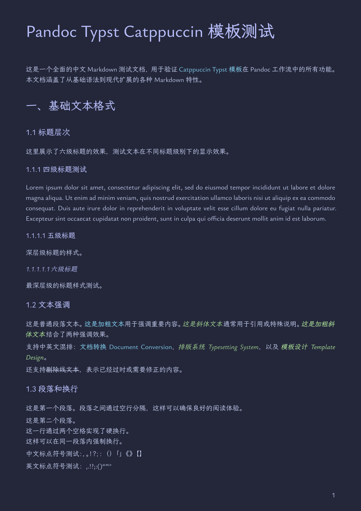
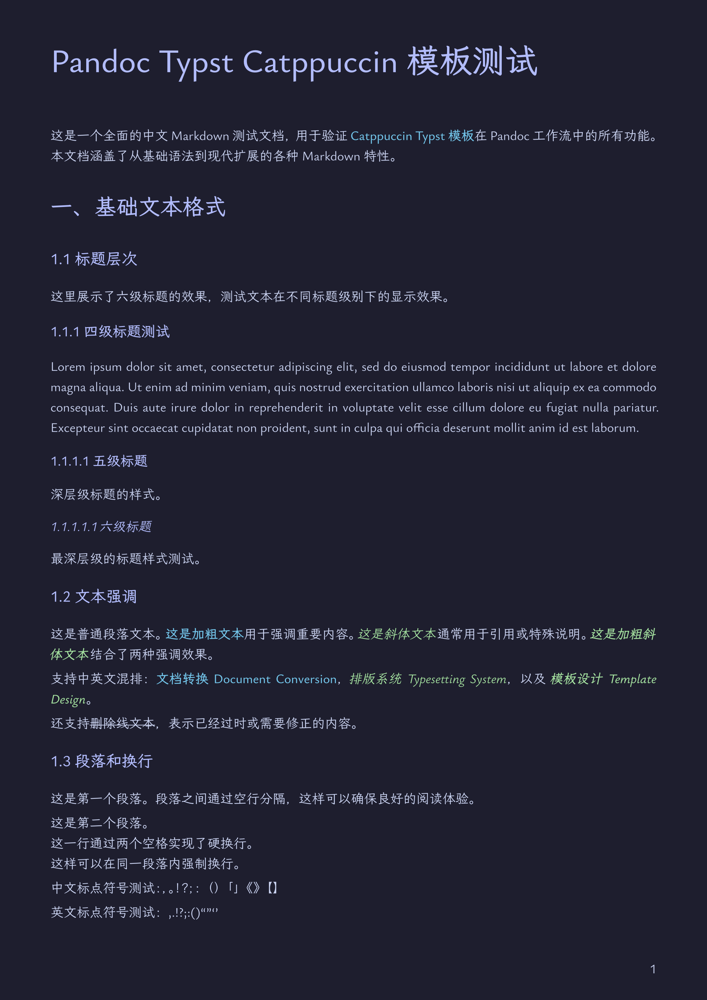

# Pandoc Typst Catppuccin

使用 [Pandoc](https://pandoc.org/) + [Typst](https://typst.app/) 将 Markdown 转换为 PDF 的预配置方案，采用 [Catppuccin](https://github.com/catppuccin/catppuccin) 配色主题，中文友好。

- 开箱即用的 Pandoc 模板和配置文件
- 基于 Catppuccin 配色（支持 4 种风味）
- 支持代码高亮、表格、数学公式等

预览 PDF：[latte.pdf](./examples/latte.pdf)、[frappe.pdf](./examples/frappe.pdf)、[macchiato.pdf](./examples/macchiato.pdf)、[mocha.pdf](./examples/mocha.pdf)

<table>
  <tr>
    <td align="center" width="25%">Latte</td>
    <td align="center" width="25%">Frappe</td>
    <td align="center" width="25%">Macchiato</td>
    <td align="center" width="25%">Mocha</td>
  </tr>
  <tr>
    <td></td>
    <td></td>
    <td></td>
    <td></td>
  </tr>
</table>

## 使用

将文件安装到 [pandoc 用户数据目录](https://pandoc.org/MANUAL.html#option--data-dir)，即可在任何位置使用：

```bash
mkdir -p ~/.local/share/pandoc/{templates,defaults}/
cp catppuccin.typ ~/.local/share/pandoc/templates/
cp catppuccin.yaml ~/.local/share/pandoc/defaults/
```

如果您安装了 [Just](https://github.com/casey/just)，也可以使用 `just install` 自动执行安装命令：

```bash
just install
```

**使用方式一：使用默认配置文件**

```bash
pandoc input.md -o output.pdf -d catppuccin
```

（注意：使用默认配置文件时，不能用 `-V` 覆盖变量内容，详情见 [Pandoc User's Guide](https://pandoc.org/MANUAL.html#defaults-files)）

**使用方式二：命令行指定配置**

```bash
pandoc input.md -o output.pdf \
    --template=catppuccin.typ \
    --pdf-engine=typst \
    -V flavor=macchiato \
    -V mainfont="LXGW Bright" \
    -V codefont="Hack Nerd Font"
```

## 配置选项

在 `catppuccin.yaml` 或命令行中可配置的主要选项：

| 选项             | 说明                                                     | 默认值           |
| ---------------- | -------------------------------------------------------- | ---------------- |
| `flavor`         | Catppuccin 风味：`latte`, `frappe`, `macchiato`, `mocha` | `macchiato`      |
| `mainfont`       | 正文字体                                                 | `LXGW Bright`    |
| `monofont`       | 等宽字体（代码）                                         | `Hack Nerd Font` |
| `fontsize`       | 字体大小                                                 | `11pt`           |
| `lang`           | 语言                                                     | `zh`             |
| `region`         | 地区                                                     | `CN`             |
| `papersize`      | 纸张大小                                                 | `a4`             |
| `page-numbering` | 页码格式                                                 | `"1"`            |
| `columns`        | 分栏数                                                   | `1`              |
